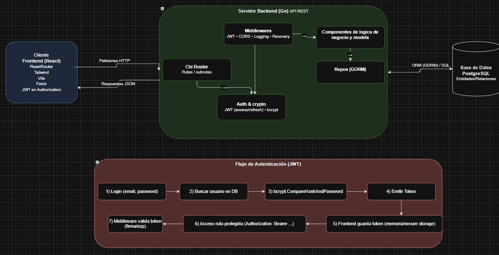

# TP Grupal Desarrollo de Software 2025 - Grupo 1

- **frontend** → React + Vite  
- **api** → Go
- **Base de datos** → Postgresql




## Crear archivo .env en /api
```bash
# Postgres
DB_HOST=localhost
DB_PORT=5432
DB_USER=postgres
DB_PASSWORD=12345678
DB_NAME=proyecto-desarrollo
DB_SSLMODE=disable

# puerto
APP_PORT=8080

# (development/production)
APP_ENV=development

# Generar documentacion
GENERATE_DOCS=0

#JWT
JWT_SECRET=asd23wfsfsdfsdfsdfsdfsdf
JWT_TTL_MIN=30

# Datos ADMIN
ADMIN_EMAIL=admin@quepc.com
ADMIN_PASSWORD=12345678
ADMIN_NAME=Administrador General

````

## Frontend
```bash
cd frontend/
npm install 
npm run dev
````

## API

```bash
cd api/
go run .
```

## Imágenes y Assets

Estructura actual de estáticos:

```
api/static/
	images/
		carreras/
		juegos/
		softwares/   (puede estar vacía hasta que se carguen)
```

- Las imágenes subidas se guardan bajo `api/static/images/<categoria>/`.
- En la base de datos se almacena la ruta relativa dentro de `static`, por ejemplo: `images/carreras/carrera-arquitectura.png` o `images/juegos/Cyberpunk_2077_box_art.jpg`.
- El servidor expone las URLs finales como `/static/images/...`.
- Si configurás `API_ASSETS_BASE_URL`, las respuestas devolverán `API_ASSETS_BASE_URL/static/images/...`; de lo contrario se usa el host de la request.

Agregar en tu `.env` de la API (opcional):

```bash
# Host base público para assets (útil con Traefik, sin slash final)
API_ASSETS_BASE_URL=http://quepc.home
```

### Migración de datos antiguos

Si antes almacenabas rutas completas (`./static/...`), ejecutá la migración:

```bash
psql -h localhost -U postgres -d db_nahue -f api/db/migrations/20251108_strip_static_prefix.sql
```

### Seed de juegos

Para cargar juegos de ejemplo:

```bash
psql -h localhost -U postgres -d db_nahue -f api/db/seeds/seed_juegos.sql
```

Luego verifica:

```bash
curl http://localhost:8080/v1/softwares?tipo=juego
curl http://localhost:8080/static/Cyberpunk_2077_box_art.jpg --output /dev/null -v
```
